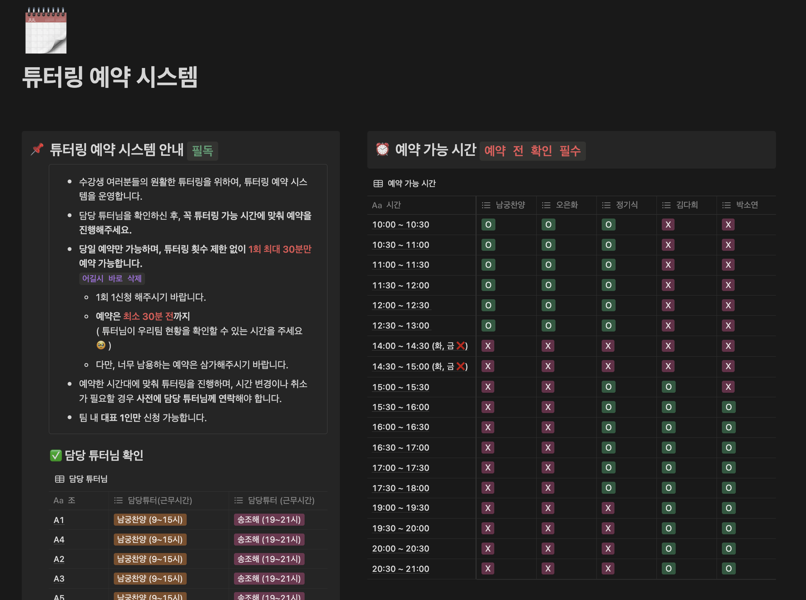
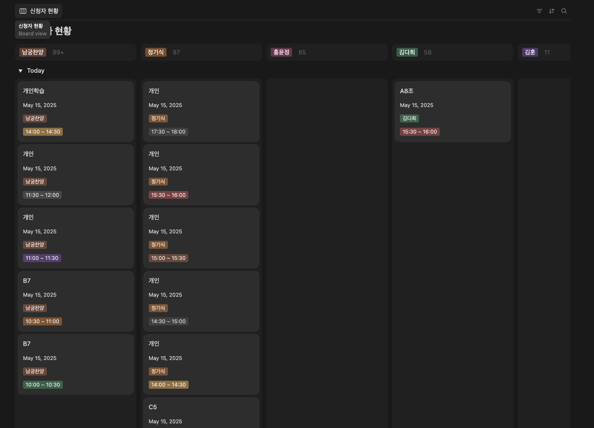
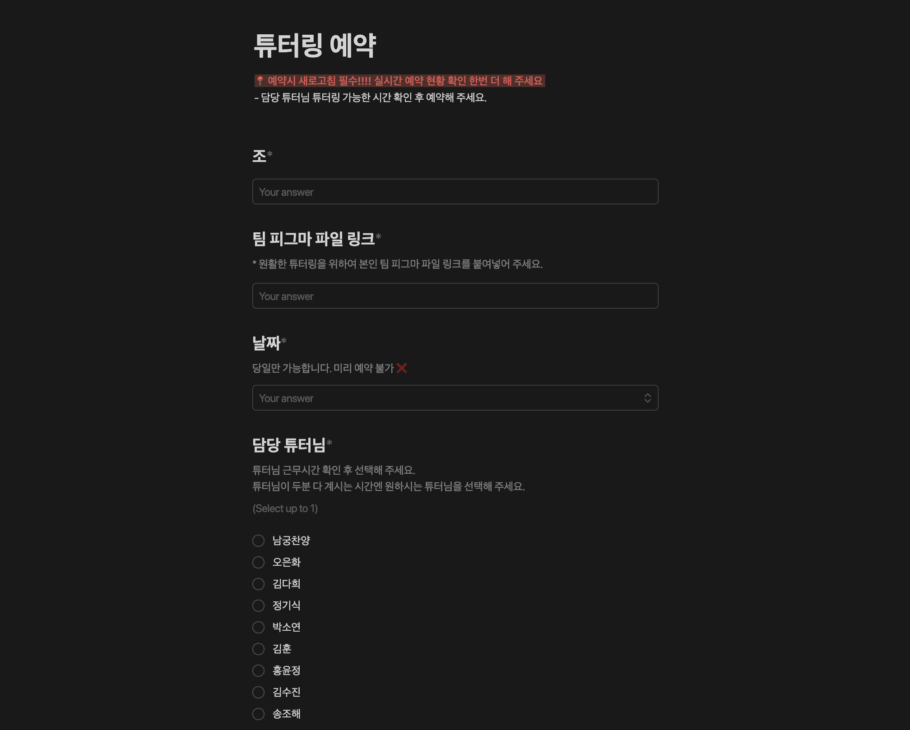
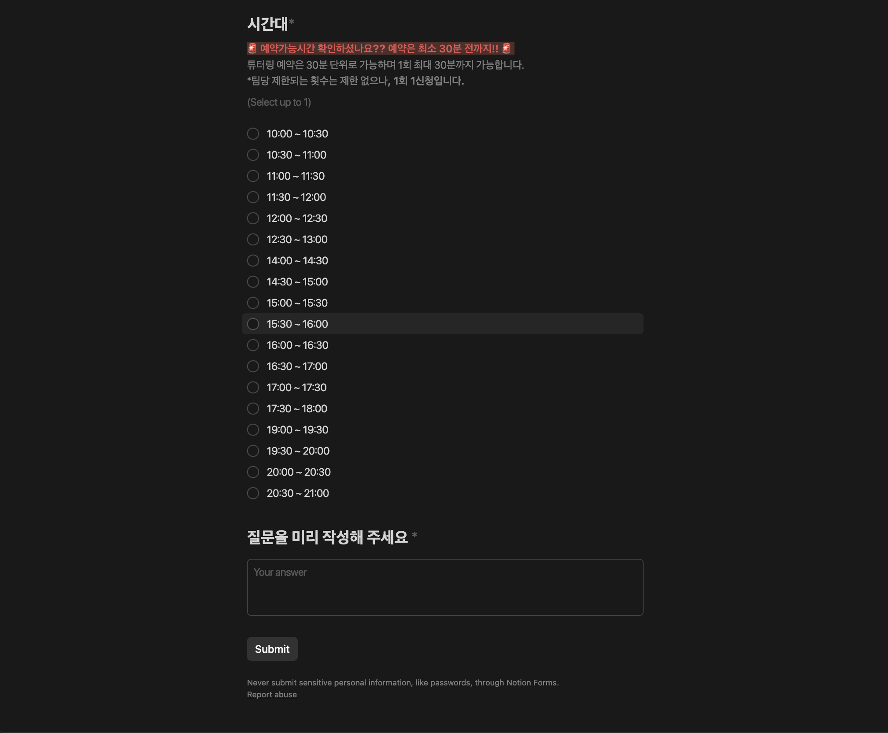
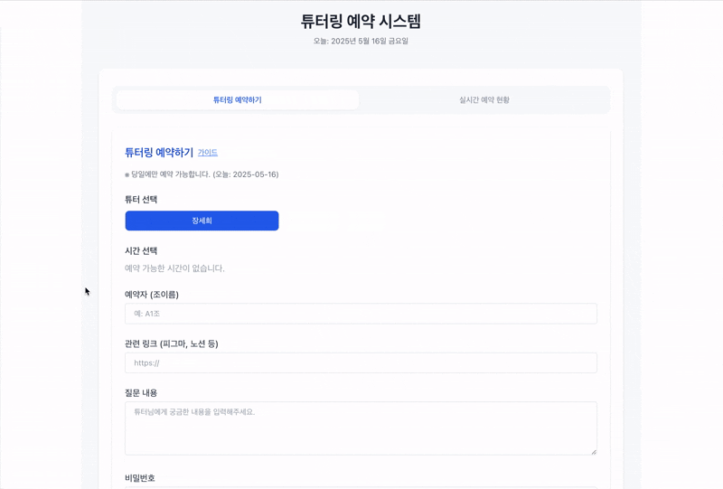

# 튜터링 예약 시스템

## 서비스 소개

튜터링 예약 시스템은 수강생과 튜터를 위한 실시간 예약 관리 플랫폼입니다. 수강생은 원하는 튜터와 시간을 선택하여 예약할 수 있으며, 튜터는 자신의 예약 내역을 관리하고 가능 시간 및 휴무일을 설정할 수 있습니다.

---

## 등장 배경

### 기존 튜터링 예약 시스템에서의 문제점

기존에 사용하던 노션 기반 튜터링 예약 시스템을, 운영 효율성과 사용자 편의성을 높이기 위해 직접 개발한 예약 관리 시스템으로 전환하였습니다.

#### 개선이 필요했던 부분

1. **실시간 예약 현황 파악이 어려움**: 시간순 정렬 및 실시간 반영 문제, 중복 예약 발생
2. **운영진 개입 비효율성**: 예약 변경·취소 요청 시 담임매니저가 직접 처리 후 튜터에게 전달
3. **튜터별 가능 시간 파악 어려움**: 각 튜터의 예약 가능 시간 확인이 번거로움
   
   
   
   

---

## 주요 기능

### ✅ 튜터링 예약하기

1. **튜터 선택**  
   수강생은 예약하고자 하는 튜터를 선택할 수 있습니다.
2. **시간 선택**  
   선택한 튜터의 가능 시간 중 원하는 시간대를 선택합니다. (현재 시간 +30분 이후부터 가능)
3. **예약 정보 입력**  
   예약자 이름, 관련 링크, 질문 내용, 비밀번호를 설정한 뒤 예약을 제출합니다.
   
   

### ✅ 실시간 예약 현황

1. **전체 예약 보기**  
   진행 예정 예약 및 지난 예약을 한눈에 확인할 수 있습니다.
2. **튜터별 예약 보기**  
   각 튜터의 가능 시간대와 예약된 시간대를 확인할 수 있으며, 예약 가능한 시간대가 명확히 구분됩니다.
3. **예약 수정**  
   비밀번호를 통해 예약 상세 정보를 확인하고 수정할 수 있습니다.

### ✅ 튜터 페이지 (`/tutor`)

1. **실시간 예약 확인**  
   튜터는 본인의 예약 내역을 실시간으로 확인할 수 있습니다.
2. **요일별 튜터링 가능 시간 설정**  
   각 요일별로 가능한 시간대를 설정할 수 있습니다.
3. **휴무일 설정**  
   특정 날짜를 휴무일로 지정하여 해당 날짜에 예약을 차단할 수 있습니다.
4. **예약 상세 확인 및 수정**  
    예약 내용을 확인하고 수정할 수 있으며, 수강생의 예약 시간 변경 요청도 처리할 수 있습니다.
   
   
   

### ✅ 튜터 기능

- 예약 등록 및 수정 시 튜터의 이메일로 알림이 자동으로 발송됩니다.

### ✅ 관리자 페이지 (`/admin`)

1. **조직, 트랙, 기수별 관리**  
   새로운 조직, 트랙, 기수를 생성하거나 기존 데이터를 수정할 수 있습니다.
2. **튜터 관리**  
   튜터 계정을 생성, 수정, 삭제할 수 있으며, 튜터별 권한을 설정할 수 있습니다.

---

## 사용 기술

- React (프론트엔드)
- Firebase Firestore (실시간 데이터베이스)
- Firebase Authentication (사용자 인증)
- Firebase Functions (이메일 알림)
- Tailwind CSS (스타일링)
